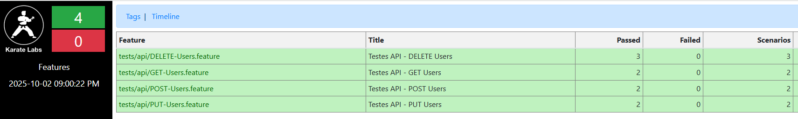

# 🥋 Estudos de Karate Framework



## 📋 Sobre o Projeto

Este repositório contém estudos práticos do **Karate Framework**, uma ferramenta poderosa para testes de **API**, **UI** e **Performance** em uma única solução. O projeto demonstra implementações de testes automatizados organizados e estruturados.

## 🚀 Tecnologias Utilizadas

- **Karate Framework** - Framework de testes
- **Maven** - Gerenciamento de dependências
- **JUnit 5** - Execução de testes
- **Chrome WebDriver** - Testes de UI
- **JSONPlaceholder API** - API para testes
- **HTTPBin** - Testes de performance

## 📁 Estrutura do Projeto

```
src/
├── test/
│   ├── java/
│   │   └── tests/
│   │       ├── AllTests.java                      # Executor principal
│   │       ├── api/
│   │       │   └── ApiTests.java                  # Testes de API
│   │       ├── ui/
│   │       │   ├── UiTests.java                   # Testes de UI
│   │       │   ├── DropdownTest.java              # Teste específico dropdown
│   │       │   ├── MenuTest.java                  # Teste específico menu
│   │       │   └── LoginTest.java                 # Teste específico login
│   │       └── performance/
│   │           └── CreateUserPerformanceRunner.java # Testes de performance
│   └── resources/
│       └── tests/
│           ├── api/                               # Features de API
│           │   ├── GET-Users.feature
│           │   ├── POST-Users.feature
│           │   ├── PUT-Users.feature
│           │   └── DELETE-Users.feature
│           ├── ui/                                # Features de UI
│           │   ├── Dropdown.feature
│           │   ├── Menu.feature
│           │   └── Login.feature
│           └── performance/                       # Features de Performance
│               └── CreateUserPerformance.feature
```

## 🔧 Instalação e Configuração

### Pré-requisitos
- Java 11+
- Maven 3.6+
- Chrome Browser (para testes UI)

### Como executar

```bash
# Clonar o repositório
git clone https://github.com/KassiaES/karate-framework.git
cd karate-framework

# Executar todos os testes
mvn test

# Executar apenas testes de API
mvn test -Dtest=ApiTests

# Executar apenas testes de UI
mvn test -Dtest=UiTests

# Executar testes de performance
mvn test -Dtest=CreateUserPerformanceRunner

# Executar teste específico
mvn test -Dtest=ApiTests#testGetUsers
```

## 📊 Relatórios

Os relatórios são gerados automaticamente em:
```
target/karate-reports/karate-summary.html
```

## 🌐 Testes de API

### Endpoints Testados (JSONPlaceholder)

- **GET** `/users` - Buscar todos os usuários
- **GET** `/users/{id}` - Buscar usuário específico
- **POST** `/users` - Criar novo usuário
- **PUT** `/users/{id}` - Atualizar usuário
- **DELETE** `/users/{id}` - Remover usuário

## 🖥️ Testes de UI

### Sites Testados

- **The Internet Herokuapp** - Elementos diversos para automação

### Funcionalidades Testadas

- **Dropdown** - Seleção de opções
- **Menu Flutuante** - Scroll e interação
- **Login** - Autenticação (planejado)

## ⚡ Testes de Performance

### Objetivo

Os testes de performance validam a capacidade de resposta da aplicação sob diferentes cargas de trabalho, garantindo que a aplicação mantenha performance aceitável.

### Implementação Atual

- **Endpoint Testado**: `https://httpbin.org/post`
- **Cenário**: Criação de usuários
- **Configuração**: 3 threads paralelas
- **Dados**: 5 cenários com dados inline
- **Validação**: Timeout de 30 segundos

### Métricas Coletadas

- **Features totais**: Número total de features executadas
- **Features passadas**: Número de features que passaram
- **Features falhadas**: Número de features que falharam
- **Tempo total**: Tempo total de execução em milissegundos
- **Threads paralelas**: Número de threads executando simultaneamente
- **Response time**: Tempo de resposta individual por requisição

## 📖 Recursos Úteis

- [Documentação Oficial do Karate](https://github.com/karatelabs/karate)
- [JSONPlaceholder API](https://jsonplaceholder.typicode.com/)
- [HTTPBin API](https://httpbin.org/)
- [The Internet Herokuapp](https://the-internet.herokuapp.com/)
- [Karate Performance Testing](https://github.com/karatelabs/karate/tree/master/karate-gatling)

## 👨‍💻 Autor

**KassiaES** - Quality Analyst

---

⭐ Se este projeto te ajudou, deixe uma estrela no repositório!